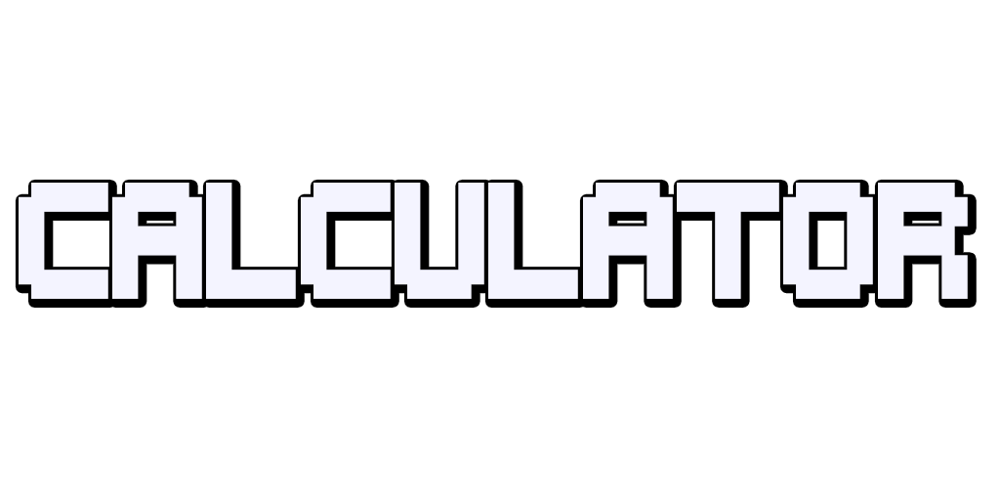

 

> **[Play the game now on Itch.io!](https://angelleyend.itch.io/calculator)**

## About the Game
Welcome to **Calculator**, where **mathematics has never been this exciting**! 🎉

Join **Sumiko**, your brilliant yet spirited math companion, as she shares her infectious passion for the numbers and calculations that govern our universe. Embark on a mathematical adventure that transforms learning into pure entertainment!

> ***"Mathematics has never been this exciting!"***

---

### Features

🌟 **Retro-Nostalgic Interface**  
Experience the charm of vintage operating systems with a beautifully crafted UI that brings back fond memories of the past.

🎵 **Lo-Fi Soundtrack**  
Relax and focus with carefully curated lo-fi music, designed to enhance your mathematical journey and keep the inspiration flowing.

🎨 **Customizable Backgrounds**  
Personalize your calculation experience by choosing from multiple stunning wallpapers, tailored to your style.

🕵️ **Hidden Secrets**  
Explore the game to discover hidden easter eggs and unlock special content for those who love surprises.

🏆 **Ultimate Challenge**  
Put your math skills to the test as you work your way toward achieving the *grand prize*. Are you ready for the ultimate challenge?

---

### Why Open Source?
Calculator has been made **completely free and open-source** so that the community can learn, improve, and share! Whether you're a developer looking for inspiration, a student eager to explore the code, or someone passionate about mathematics, this project is for you. Feel free to contribute or use it as a reference for your own projects!

---

#### 🚀 DIVE INTO THE WONDERFUL WORLD OF MATHEMATICS WITH SUMIKO TODAY! 🚀

---

## Get Started

1. Clone the repository:
    ```bash
    git clone https://github.com/AngelLeyend/Calculator-Godot
    ```
2. Open the project in [Godot Engine 4.4](https://godotengine.org/).
3. Run the game and start exploring! 🎮

---

## Contribute

Help us make Calculator even better! 💡 If you have ideas for features, bug fixes, or improvements, feel free to submit a pull request or open an issue.

---


📄 See `LICENSE` for more details.